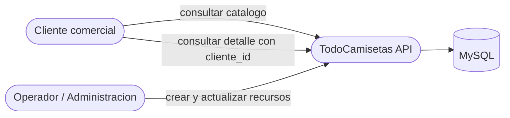
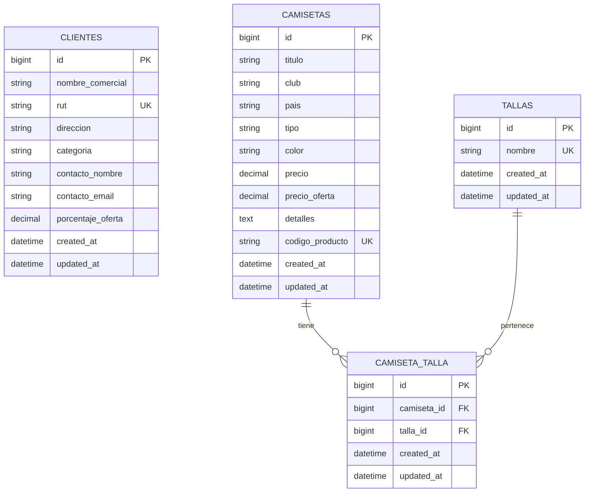

# Guia de Endpoints - TodoCamisetas API

> **Tipo de documento:** Anexo tecnico de apoyo
> **Version API:** 1.0.0
> **Base URL:** `http://localhost:8080/api`

---

## Indice

1. [Arquitectura general](#1-arquitectura-general)
2. [Modelo de datos](#2-modelo-de-datos)
3. [Convenciones de la API](#3-convenciones-de-la-api)
4. [Recurso: Health](#4-recurso-health)
5. [Recurso: Camisetas](#5-recurso-camisetas)
6. [Recurso: Clientes](#6-recurso-clientes)
7. [Recurso: Tallas](#7-recurso-tallas)
8. [Regla de negocio: precio final](#8-regla-de-negocio-precio-final)
9. [Resumen de endpoints](#9-resumen-de-endpoints)
10. [Codigos de respuesta](#10-codigos-de-respuesta)
11. [Decisiones de implementacion](#11-decisiones-de-implementacion)

---

## 1. Arquitectura general

TodoCamisetas es un proveedor B2B de camisetas de futbol. La API REST debe permitir administrar el catalogo de camisetas, los clientes comerciales y las tallas disponibles, ademas de calcular el `precio_final` de una camiseta segun el cliente que la consulta.



### Objetivo funcional

- administrar `camisetas`
- administrar `clientes`
- administrar `tallas`
- asociar tallas a camisetas mediante tabla pivote
- calcular `precio_final` en `GET /camisetas/{id}` usando `cliente_id` como query param

---

## 2. Modelo de datos

### Relaciones entre entidades



### Campos implementados

#### Tabla `clientes`

| Campo | Tipo sugerido | Regla principal |
| --- | --- | --- |
| `nombre_comercial` | string | requerido |
| `rut` | string | requerido, unico |
| `direccion` | string | requerido |
| `categoria` | enum/string | requerido: `Regular` o `Preferencial` |
| `contacto_nombre` | string | requerido |
| `contacto_email` | string | requerido, email |
| `porcentaje_oferta` | decimal | opcional |

#### Tabla `camisetas`

| Campo | Tipo sugerido | Regla principal |
| --- | --- | --- |
| `titulo` | string | requerido |
| `club` | string | requerido |
| `pais` | string | requerido |
| `tipo` | string | requerido |
| `color` | string | requerido |
| `precio` | decimal | requerido, mayor o igual a 0 |
| `precio_oferta` | decimal | opcional, nullable |
| `detalles` | text | opcional |
| `codigo_producto` | string | requerido, unico |

#### Tabla `tallas`

| Campo | Tipo sugerido | Regla principal |
| --- | --- | --- |
| `nombre` | string | requerido, unico |

### Decisiones de modelado

- `clientes` y `camisetas` no tienen relacion fisica directa.
- `tallas` se modela como catalogo reutilizable.
- la relacion `camisetas` - `tallas` es muchos a muchos.
- `cliente_id` no se guarda en `camisetas`; solo se usa en consulta.
- `precio_final` no se persiste; se calcula en tiempo de respuesta.

### Regla funcional derivada

- si el cliente es `Preferencial` y la camiseta tiene `precio_oferta`, entonces `precio_final = precio_oferta`
- en cualquier otro caso, `precio_final = precio`

---

## 3. Convenciones de la API

### Formato de respuestas

**Exito**

```json
{
  "success": true,
  "data": {}
}
```

**Error**

```json
{
  "success": false,
  "message": "Descripcion del error",
  "errors": {
    "campo": ["mensaje de validacion"]
  }
}
```

`errors` solo debe aparecer en errores de validacion.

### Encabezados requeridos

Para `POST`, `PUT` y endpoints de asociacion con body JSON:

```text
Content-Type: application/json
Accept: application/json
```

### Reglas generales

- todas las respuestas deben devolverse en JSON
- todas las validaciones deben ejecutarse antes de persistir
- los recursos inexistentes deben responder `404`
- los errores por validacion de datos deben responder `422`
- los conflictos de integridad de asociaciones o borrados restringidos deben responder `409` cuando corresponda

### Parametros de ruta

- `{id}` representa el identificador del recurso principal
- `{tallaId}` representa el identificador de una talla asociada

---

## 4. Recurso: Health

### `GET /health`

Permite verificar que la API esta operativa.

**Respuesta 200:**

```json
{
  "status": "online",
  "service": "TodoCamisetas API",
  "version": "1.0.0",
  "timestamp": "2026-06-11T10:30:00+00:00"
}
```

---

## 5. Recurso: Camisetas

Gestiona el catalogo principal de productos.

### `GET /camisetas`

Lista camisetas registradas.

**Query params opcionales**

| Parametro | Tipo | Descripcion |
| --- | --- | --- |
| `club` | string | filtra por club |
| `pais` | string | filtra por pais |
| `tipo` | string | filtra por tipo |
| `color` | string | filtra por color |

**Respuesta 200:** array de camisetas.

### `POST /camisetas`

Crea una camiseta.

**Body sugerido**

```json
{
  "titulo": "Camiseta Local 2025",
  "club": "Seleccion Chilena",
  "pais": "Chile",
  "tipo": "Local",
  "color": "Rojo",
  "precio": 45000,
  "precio_oferta": 39990,
  "detalles": "Tela dry-fit, version hincha",
  "codigo_producto": "CHI-LOC-2025-01"
}
```

**Respuesta 201:** camiseta creada.

### `GET /camisetas/{id}`

Obtiene el detalle de una camiseta.

**Query params opcionales**

| Parametro | Tipo | Descripcion |
| --- | --- | --- |
| `cliente_id` | integer | calcula `precio_final` segun el cliente |

**Respuesta 200:** camiseta con tallas asociadas y `precio_final`.

### `PUT /camisetas/{id}`

Actualiza una camiseta existente.

**Body:** mismo contrato de `POST`, con campos actualizables.

### `DELETE /camisetas/{id}`

Elimina la camiseta.

**Respuesta 200:** confirmacion de eliminacion.

### Ejemplo de respuesta de detalle

```json
{
  "success": true,
  "data": {
    "id": 1,
    "titulo": "Camiseta Local 2025",
    "club": "Seleccion Chilena",
    "pais": "Chile",
    "tipo": "Local",
    "color": "Rojo",
    "precio": 45000,
    "precio_oferta": 39990,
    "precio_final": 39990,
    "codigo_producto": "CHI-LOC-2025-01",
    "tallas": [
      { "id": 1, "nombre": "M" },
      { "id": 2, "nombre": "L" }
    ]
  }
}
```

---

## 6. Recurso: Clientes

Gestiona los clientes comerciales que consultan y compran camisetas.

### `GET /clientes`

Lista clientes registrados.

### `POST /clientes`

Crea un cliente.

**Body sugerido**

```json
{
  "nombre_comercial": "90minutos",
  "rut": "76123456-7",
  "direccion": "Av. Apoquindo 1234, Las Condes",
  "categoria": "Preferencial",
  "contacto_nombre": "Carla Paredes",
  "contacto_email": "compras@90minutos.cl",
  "porcentaje_oferta": 10
}
```

**Respuesta 201:** cliente creado.

### `GET /clientes/{id}`

Obtiene un cliente por ID.

### `PUT /clientes/{id}`

Actualiza un cliente existente.

### `DELETE /clientes/{id}`

Elimina un cliente.

### Valores admitidos para `categoria`

- `Regular`
- `Preferencial`

---

## 7. Recurso: Tallas

Gestiona el catalogo de tallas y su asociacion con camisetas.

### `GET /tallas`

Lista tallas disponibles.

### `POST /tallas`

Crea una talla.

**Body sugerido**

```json
{
  "nombre": "M"
}
```

### `GET /tallas/{id}`

Obtiene una talla por ID.

### `PUT /tallas/{id}`

Actualiza una talla existente.

### `DELETE /tallas/{id}`

Elimina una talla si no rompe integridad.

### `GET /camisetas/{id}/tallas`

Lista las tallas asociadas a una camiseta.

### `POST /camisetas/{id}/tallas`

Asocia una talla existente a una camiseta existente.

**Body sugerido**

```json
{
  "talla_id": 2
}
```

### `DELETE /camisetas/{id}/tallas/{tallaId}`

Desasocia una talla de una camiseta.

---

## 8. Regla de negocio: precio final

### Endpoint involucrado

`GET /camisetas/{id}?cliente_id={clienteId}`

### Logica implementada

1. buscar la camiseta solicitada
2. si llega `cliente_id`, buscar el cliente
3. si el cliente existe y su `categoria` es `Preferencial`, evaluar `precio_oferta`
4. si `precio_oferta` tiene valor, devolverla como `precio_final`
5. en cualquier otro caso, devolver `precio` como `precio_final`
6. incluir las tallas asociadas en la respuesta

### Caso 1: cliente preferencial con oferta

```json
{
  "success": true,
  "data": {
    "id": 1,
    "titulo": "Camiseta Local 2025",
    "precio": 45000,
    "precio_oferta": 39990,
    "precio_final": 39990,
    "cliente_consultado": {
      "id": 1,
      "categoria": "Preferencial"
    }
  }
}
```

### Caso 2: cliente regular o sin oferta

```json
{
  "success": true,
  "data": {
    "id": 1,
    "titulo": "Camiseta Local 2025",
    "precio": 45000,
    "precio_oferta": null,
    "precio_final": 45000,
    "cliente_consultado": {
      "id": 2,
      "categoria": "Regular"
    }
  }
}
```

### Error posible

Si se envia `cliente_id` y el cliente no existe, la API debe responder `404`.

---

## 9. Resumen de endpoints

| Metodo | Ruta | Proposito |
| --- | --- | --- |
| `GET` | `/api/health` | verificar estado de la API |
| `GET` | `/api/camisetas` | listar camisetas |
| `POST` | `/api/camisetas` | crear camiseta |
| `GET` | `/api/camisetas/{id}` | ver camiseta y calcular `precio_final` |
| `PUT` | `/api/camisetas/{id}` | actualizar camiseta |
| `DELETE` | `/api/camisetas/{id}` | eliminar camiseta |
| `GET` | `/api/clientes` | listar clientes |
| `POST` | `/api/clientes` | crear cliente |
| `GET` | `/api/clientes/{id}` | ver cliente |
| `PUT` | `/api/clientes/{id}` | actualizar cliente |
| `DELETE` | `/api/clientes/{id}` | eliminar cliente |
| `GET` | `/api/tallas` | listar tallas |
| `POST` | `/api/tallas` | crear talla |
| `GET` | `/api/tallas/{id}` | ver talla |
| `PUT` | `/api/tallas/{id}` | actualizar talla |
| `DELETE` | `/api/tallas/{id}` | eliminar talla |
| `GET` | `/api/camisetas/{id}/tallas` | listar tallas asociadas |
| `POST` | `/api/camisetas/{id}/tallas` | asociar talla |
| `DELETE` | `/api/camisetas/{id}/tallas/{tallaId}` | desasociar talla |

---

## 10. Codigos de respuesta

| Codigo | Uso esperado |
| --- | --- |
| `200` | consulta, actualizacion o eliminacion exitosa |
| `201` | creacion exitosa |
| `404` | recurso no encontrado |
| `409` | conflicto de integridad o asociacion duplicada |
| `422` | error de validacion |

---

## 11. Decisiones de implementacion

- `codigo_producto` debe ser unico en `camisetas`
- `rut` debe ser unico en `clientes`
- `nombre` debe ser unico en `tallas`
- la asociacion `camiseta_id` + `talla_id` no debe duplicarse
- `cliente_id` solo participa en consulta, no en persistencia
- el endpoint de detalle de camiseta debe incluir tallas asociadas
- los datos semilla recomendados son `90minutos`, `tdeportes`, y tallas `S`, `M`, `L`, `XL`
- la API usa respuestas JSON homogeneas con `success`, `data`, `message` y `errors` segun corresponda
- los duplicados de `rut`, `codigo_producto` y `nombre` se resuelven por validacion y responden `422`
- los `409` implementados cubren asociacion de talla duplicada y eliminacion de talla asociada a camisetas

### Criterios aplicados en la implementacion

- `DELETE` se puede implementar como borrado fisico mientras no exista un requerimiento de historico
- `porcentaje_oferta` puede mantenerse almacenado aunque la regla principal use `precio_oferta`
- el precio diferencial del examen se resuelve en la capa de controlador o servicio, no en la base de datos
